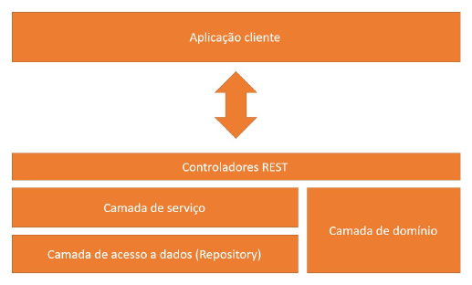
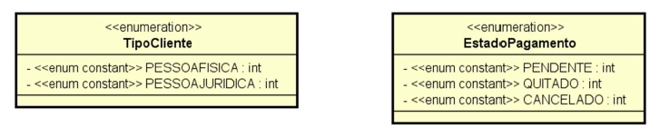
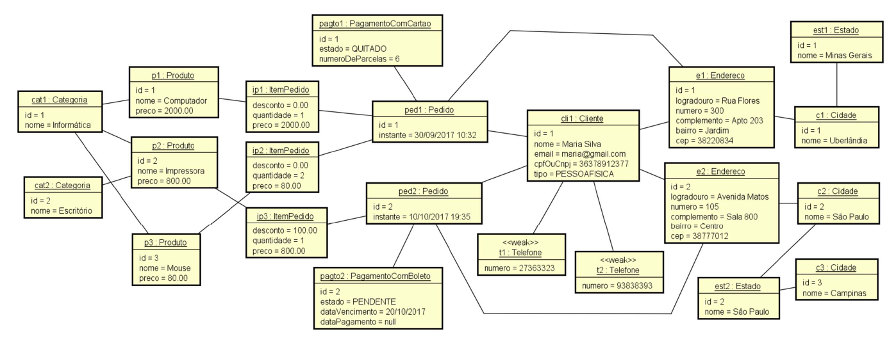
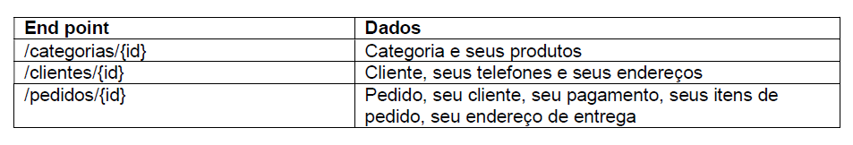

# Spring Boot, Hibernate, REST, Ionic, JWT, S3, MySQL, MongoDB

## Sumário

- [Implementação do Modelo Conceitual](#Implementação-do-modelo-conceitual)
- [Operações de CRUD e Casos de Uso](#Operações-de-CRUD-e-Casos-de-Uso)
- [Banco de dados MySQL e Implantação no Heroku](#Banco-de-dados-MySQL-e-Implantação-no-Heroku)
- [Serviço de email](#Serviço-de-email)
- [Autenticação e autorização com tokens JWT](#Autenticação-e-autorização-com-tokens-JWT)
- [Armazenamento de imagens usando Amazon S3](#Armazenamento-de-imagens-usando-Amazon-S3)
- [Ajustes finais no backend e bucket](#Ajustes-finais-no-backend-e-bucket)
- [Aplicação Ionic - Parte 1/2](#Aplicação-Ionic-Parte-1/2)
- [Aplicação Ionic - Parte 2/2](#Aplicação-Ionic-Parte-2/2)
- [Finalização, build e publicação na Play Store](#Finalização-build-e-publicação-na-Play-Store)
- [Ajustes no app Ionic](#Ajustes-no-app-Ionic)

## Implementação do Modelo Conceitual

### Objetivo geral:

O estudo de caso tem como objetivo mostrar como um modelo conceitual (modelo de
domínio em nível de análise) pode ser implementado sobre o paradigma orientado a objetos, usando padrões de
mercado e boas práticas.

### Tópicos:

- Associações
  - Um para muitos / muitos para um
  - Um para um
  - Muitos para muitos comum
  - Muitos para muitos com classe de associação
  - Bidirecionais / direcionadas
- Conceito independente / dependente
- Classe de associação
- Herança
- Enumerações
- Atributos Embedded (ItemPedidoPK)
- Coleções ElementCollection (telefones de um cliente)

### Estrutura de camadas:

### Diagrama:

**Modelo Conceitual:**

**Enumerações:**

### Estrutura de camadas:

**Instâncias do Modelo Conceitual:**
Gerar uma base de dados relacional automaticamente a partir do modelo conceitual, bem como povoar a base com a instância dada.

### End point:

Recuperar os dados e disponibilizá-los por meio de uma API Rest BÁSICA com os seguintes end points:

### Basic tips:

- Checklist para criar **entidades**:
  - Atributos básicos
  - Associações (inicie as coleções)
  - Construtores (não inclua coleções no construtor com parâmetros)
  - Getters e setters
  - hashCode e equals (implementação padrão: somente id)
  - Serializable (padrão: 1L)
- Checklist de **endpoint**:
  - Criar o Service
  - Criar o Repository
  - Criar o Resource (Controller)
  - Proteger contra serialização Json cíclica
- Checklist proteção para **referência cíclica** na serialização Json:
  - @JsonManagedReference
  - @JsonBackReference
    - Ou **usar apenas** _@JsonIgnore_ nas classes onde ficaria o _@JsonBackReference_ **omitindo** anotação _@JsonManagedReference_ nas outras classes.
- Checklist de tratamento de **exceção** de _id inválido_:
  - Criar ObjectNotFountException
  - Criar StandardError
  - Criar ResourceExceptionHandler

## Operações de CRUD e Casos de Uso

- Todo

## Banco de dados MySQL e Implantação no Heroku

- Todo

## Serviço de email

- Todo

## Autenticação e autorização com tokens JWT

- Todo

## Armazenamento de imagens usando Amazon S3

- Todo

## Ajustes finais no backend e bucket

- Todo

## Aplicação Ionic - Parte 1/2

- Todo

## Aplicação Ionic - Parte 2/2

- Todo

## Finalização, build e publicação na Play Store

- Todo

## Ajustes no app Ionic

- Todo
