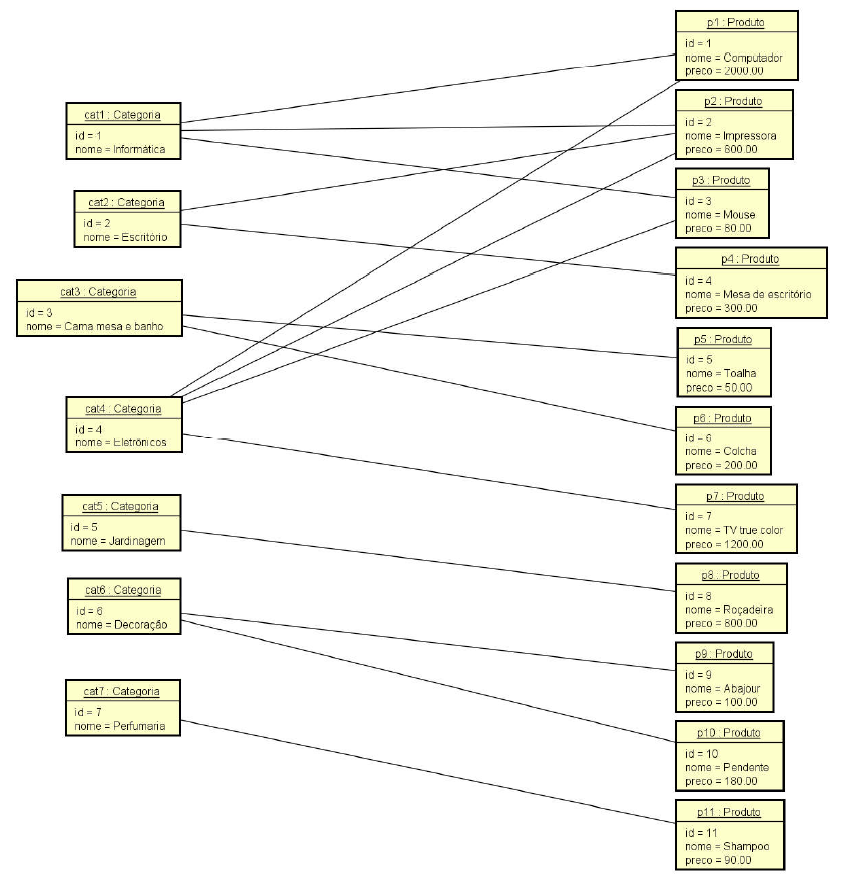

# Spring Boot, Hibernate, REST, Ionic, JWT, S3, MySQL, MongoDB

## Sumário

- [Implementação do Modelo Conceitual](#Implementação-do-modelo-conceitual)
- [Operações de CRUD e Casos de Uso](#Operações-de-CRUD-e-Casos-de-Uso)
- [Banco de dados MySQL e Implantação no Heroku](#Banco-de-dados-MySQL-e-Implantação-no-Heroku)
- [Serviço de email](#Serviço-de-email)
- [Autenticação e autorização com tokens JWT](#Autenticação-e-autorização-com-tokens-JWT)
- [Armazenamento de imagens usando Amazon S3](#Armazenamento-de-imagens-usando-Amazon-S3)
- [Ajustes finais no backend e bucket](#Ajustes-finais-no-backend-e-bucket)
- [Aplicação Ionic - Parte 1/2](#Aplicação-Ionic-Parte-1/2)
- [Aplicação Ionic - Parte 2/2](#Aplicação-Ionic-Parte-2/2)
- [Finalização, build e publicação na Play Store](#Finalização-build-e-publicação-na-Play-Store)
- [Ajustes no app Ionic](#Ajustes-no-app-Ionic)

## Implementação do Modelo Conceitual

### Objetivo geral:

O estudo de caso tem como objetivo mostrar como um modelo conceitual (modelo de
domínio em nível de análise) pode ser implementado sobre o paradigma orientado a objetos, usando padrões de
mercado e boas práticas.

### Tópicos:

- Associações
  - Um para muitos / muitos para um
  - Um para um
  - Muitos para muitos comum
  - Muitos para muitos com classe de associação
  - Bidirecionais / direcionadas
- Conceito independente / dependente
- Classe de associação
- Herança
- Enumerações
- Atributos Embedded (ItemPedidoPK)
- Coleções ElementCollection (telefones de um cliente)

### Estrutura de camadas:

### Diagrama:

**Modelo Conceitual:**

**Enumerações:**

### Estrutura de camadas:

**Instâncias do Modelo Conceitual:**
Gerar uma base de dados relacional automaticamente a partir do modelo conceitual, bem como povoar a base com a instância dada.

### End point:

Recuperar os dados e disponibilizá-los por meio de uma API Rest BÁSICA com os seguintes end points:

### Basic tips:

- Checklist para criar **entidades**:
  - Atributos básicos
  - Associações (inicie as coleções)
  - Construtores (não inclua coleções no construtor com parâmetros)
  - Getters e setters
  - hashCode e equals (implementação padrão: somente id)
  - Serializable (padrão: 1L)
- Checklist de **endpoint**:
  - Criar o Service
  - Criar o Repository
  - Criar o Resource (Controller)
  - Proteger contra serialização Json cíclica
- Checklist proteção para **referência cíclica** na serialização Json:
  - @JsonManagedReference
  - @JsonBackReference
    - Ou **usar apenas** _@JsonIgnore_ nas classes onde ficaria o _@JsonBackReference_ **omitindo** anotação _@JsonManagedReference_ nas outras classes.
- Checklist de tratamento de **exceção** de _id inválido_:
  - Criar ObjectNotFountException
  - Criar StandardError
  - Criar ResourceExceptionHandler

 

## Operações de CRUD e Casos de Uso

### Objetivo geral:

Implementar operações de CRUD e de casos de uso conforme boas práticas de Engenharia de Software.

- Competências:

  - Implementar requisições _POST_, _GET_, _PUT_ e _DELETE_ para inserir, obter, atualizar e deletar
    entidades, respectivamente, seguindo boas práticas _REST_ e de desenvolvimento em camadas.
  - Trabalhar com DTO (Data Transfer Object)
  - Trabalhar com paginação de dados
  - Trabalhar com validação de dados com Bean Validation (javax.validation)
  - Criar validações customizadas
  - Fazer tratamento adequado de exceções (incluindo integridade referencial e validação)
  - Efetuar consultas personalizadas ao banco de dados

 

### Apresentando o Caso de Uso

|                   | Registrar Pedido                                                                                          |
| ----------------- | :-------------------------------------------------------------------------------------------------------- |
| **Atores**        | Cliente                                                                                                   |
| **Interessados**  | Departamento de vendas                                                                                    |
| **Precondições**  | Cliente cadastrado                                                                                        |
| **Pós-condições** | -                                                                                                         |
| **Visão geral**   | Este caso de uso consiste no processo de escolha de produtos e fechamento de pedido por parte do cliente. |

 

|              | Cenário Principal de SUCESSO                                                                                       |
| ------------ | :----------------------------------------------------------------------------------------------------------------- |
| **1.[OUT]**  | O **sistema** informa os nomes de todas categorias ordenadamente.                                                  |
| **2.[IN]**   | O **cliente** informa um trecho de nome de produto desejado, e seleciona as categorias desejadas.                  |
| **3.[OUT]**  | O **sistema** informa nome e preço dos produtos que se enquadram na pesquisa.                                      |
| **4.[IN]**   | O **cliente** seleciona um produto para adicionar ao carrinho de compras (\*).                                     |
| **5.[OUT]**  | O **sistema** exibe o carrinho de compras (\*\*).                                                                  |
| **6.[IN]**   | O **cliente** informa que deseja fechar o pedido, e informa seu usuário e senha.                                   |
| **7.[OUT]**  | O **sistema** informa logradouro, numero, complemento, bairro, cep, cidade e estado de todos endereços do cliente. |
| **8.[IN]**   | O **cliente** seleciona um endereço para entrega.                                                                  |
| **9.[OUT]**  | O **sistema** exibe as formas de pagamento.                                                                        |
| **10.**      | O **cliente** escolhe uma das opções:                                                                              |
|              | **10.1** Variante: Pagamento com boleto                                                                            |
|              | **10.1** Variante: Pagamento com cartão                                                                            |
| **11.[OUT]** | O **sistema** informa a confirmação do pedido (\*\*\*).                                                            |

 

|                   | Cenários Alternativos: VARIANTES:                                                          |
| ----------------- | :----------------------------------------------------------------------------------------- |
| **Variante 5.1**  | **Nova busca**                                                                             |
|                   | **5.1.1[IN]** O **cliente** informa que deseja realizar uma nova busca.                    |
|                   | **5.1.2** Vai para 1.                                                                      |
|                   |                                                                                            |
| **Variante 10.1** | **Pagamento com boleto**                                                                   |
|                   | **10.1.1[IN]** O **cliente** informa que deseja pagar com boleto.                          |
|                   |                                                                                            |
| **Variante 10.2** | **Pagamento com cartão**                                                                   |
|                   | **10.2.1[IN]** O **cliente** informa que deseja pagar com cartão e informa a quantidade de |
| parcelas.         |

 

|                  | Cenários Alternativos: EXCEÇÕES:                                        |
| ---------------- | :---------------------------------------------------------------------- |
| **Variante 6.1** | **Falha na autenticação**                                               |
|                  | **6.1.1** O **sistema** informa mensagem de usuário ou senha inválidos. |
|                  | **6.1.2** Vai para 6.                                                   |

 

| Informações complementares                                                                                                                                                                                                                                                                           |
| ---------------------------------------------------------------------------------------------------------------------------------------------------------------------------------------------------------------------------------------------------------------------------------------------------- |
| (\*) Quando um produto já existente no carrinho é selecionado, a quantidade deste produto no carrinho deve ser incrementada, caso contrário o produto é adicionado ao carrinho com quantidade 1.                                                                                                     |
| (\*\*) As informações do carrinho de compras são: nome, quantidade e preço unitário de cada produto (não será dado desconto), o subtotal de cada item do carrinho, e o valor total do carrinho.                                                                                                      |
| (\*\*\*) As informações da confirmação do pedido são: número, data e horário do pedido, valor total do pedido, bem como o tipo e estado do pagamento (Pendente). Caso o pagamento seja com boleto, informar a data de vencimento, e caso o pagamento seja com cartão, informar o número de parcelas. |

 

**Validações de dados**

- **Sem acesso a dados**

  - **Sintáticas**:
    - Campo não pode ser vazio
    - Valor numérico mínimo e máximo
    - Comprimento de string mínimo e máximo
    - somente dígitos
      Padrão (expressão regular): (##)-####-####
  - **Outras**:
    - Data futura / passada
  - **Mais de um campo**
    - Confirmação de senha igual à senha

- **Com acesso a dados**

  - Email não pode ser repetido
  - Cada cliente pode cadastrar no máximo três cupons por mês

- **Entidade Categoria:**
  - Validações sintáticas
    - Nome não pode ser vazio
    - Nome deve conter entre 5 e 80 caracteres

 

**Instâncias do Modelo Conceitual:**

### Basic tips:

- Checklist para criar **validação customizada**:
  - Criar a anotação customizada
  - Criar o Valitator personalizado para esta anotação e para o nosso DTO
  - Programar o Validator, fazendo testes e inserindo as mensagens de erro
  - Anotar nosso DTO com a nova anotação criada

 

## Banco de dados MySQL e Implantação no Heroku

### Objetivo geral:

- Incluir banco de dados relacional MySQL ao projeto para ser utilizado tanto em desenvolvimento quanto em produção.
- Definir profiles de projeto (teste, desenvolvimento, produção).
- Implantar o backend no Heroku

### Tópicos e dicas:

- Instalação do MySQL
  - Sugestão: Xampp
- Criando profile de **teste**
  - application-test.properties
  - application.properties
    - spring.profiles.active=**test**
- Criando profile de **desenvolvimento**
  - application-dev.properties
  - application.properties
    - spring.profiles.active=**dev**
- Instalando/preparando o **Heroku**
  - Cadastrando-se no Heroku
    - Acesse heroku.com e faça o procedimento
      - Sign up
      - Preencha os dados e envie o formulário
      - Abra seu email e clique no link de confirmação
      - Defina uma senha
- Criando um novo app
  - Create New App
  - Nome (opcional)
  - Escolha a localidade
- Instalação do MySQL no Heroku
  - Aba Overview -> Configure Add-ons
  - Procure "MySQL" na caixa de pesquisa e escolha o ClearDB MySQL
  - Escolha o plano e clique em Provide
    - Cadastrar um cartão de crédito (https://dashboard.heroku.com/account/billing)
    - Documentação do ClearDB: https://devcenter.heroku.com/articles/cleardb
- Instalação do Heroku CLI
  - https://devcenter.heroku.com/articles/heroku-cli#download-and-install
  - Escolha a versão para seu sistema faça o procedimento de instalação
  - Abra o terminal (no Windows o cmd) e faça login:
    - heroku login

### Dump da base de dados para o Heroku

- 1 - Gere um backup da base de dados local
- 2 - Associe o repositório local com o Heroku
- 3 - Execute o SQL gerado no servidor do Heroku
  - 3.1 - Obtenha a URL do banco de dados
  - 3.2 - Com base nos dados da URL de conexão, monte o comando para executar o arquivo SQL no servidor

### Configuração e envio do projeto para produção

- 1 - Obtenha a URL do banco de dados
- 2 - Crie o arquivo application-prod.properties
- 3 - Crie o arquivo Procfile
- 4 - Envie o projeto para o Heroku

 

## Serviço de email

- Todo

## Autenticação e autorização com tokens JWT

- Todo

## Armazenamento de imagens usando Amazon S3

- Todo

## Ajustes finais no backend e bucket

- Todo

## Aplicação Ionic - Parte 1/2

- Todo

## Aplicação Ionic - Parte 2/2

- Todo

## Finalização, build e publicação na Play Store

- Todo

## Ajustes no app Ionic

- Todo
